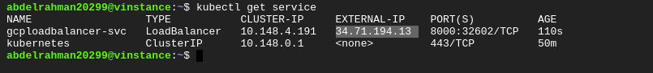
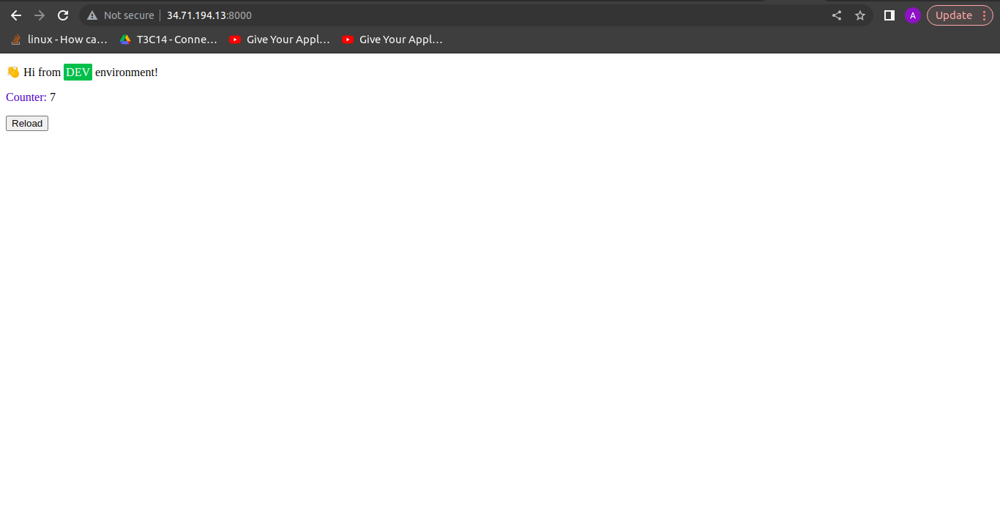

# GCP-project

This folder provides the Devops-Challenge and modules for Infrastructure as Code Using Terraform and k8s for yml files for kubernetes cluster deployments and services.

## This folder contains the following folders

1. Devops-Challenge - It contains python code.
2. modules - It contains the essential files (.tf).
3. k8s - It contains the essential files (.yml).

## Dependencies

1. GCP account
    You would require to have an GCP account to be able to build cloud infrastructure.

2. VS code editor
    An editor would be helpful to visualize the image as well as code.

3. Terraform
    You would require to install Terraform to be able to build cloud infrastructure.

## How to Use

1. Set up GCP

    **After creating your GCP account, create or modify the following resources to enable Terraform to provision your infrastructure:**

    - A GCP Project:Create one now in the GCP console and make note of the project id.
    - Google Compute Engine: Enable Google Compute Engine for your project in the GCP console. Make  sure to select the project you are created and click the "Enable" button.
    - A GCP service account key: Create a service account key to enable Terraform to access your GCP account.
    When creating the key, use the following settings:
      - Select the project you created in the previous step.
      - Click "Create Service Account".
      - Give it name(terraform-sa)  and click "Create".
      - For the Role, choose "Project -> Editor", then click "Continue".
      - Skip granting additional users access, and click "Done".
    - After you create your service account, download your service account key.
      - Select your service account from the list.
      - Select the "Keys" tab.
      - In the drop down menu, select "Create new key".
      - Leave the "Key Type" as JSON.
      - Click "Create" to create the key and save the key file to your system.
  
2. Clone the repository from <https://github.com/Abdelrahman771/Devops-Challenge-GCP>

    Note: Don't forget to copy credintial key to this directory and chenge it in code and also change project id with project id you created

    ``` bash
    #Run terraform init to initialize the project
    terraform init 
    #Run terraform plan to preview the changes that will be made
    terraform plan
    #Run terraform apply to create the resources
    terraform apply
    ```

3. From Local build and push images to GCR

   NOTE: Dockerfile will be found in  Devops-Challenge-Demo-Code folder TO BUILD IMAGES
   
    ``` bash
    sudo docker build  . -t abdelrahman20299/python:v1.0
    ```

    TO PUSH IMAGES TO GCR

    ```bash
    sudo docker tag abdelrahman20299/python:v1.0 us.gcr.io/abdelrahman-ahmed-iti-project/abdelrahman20299/python:v1.0
    gcloud auth configure-docker
    gcloud docker -- push us.gcr.io/abdelrahman-ahmed-iti-project/abdelrahman20299/python:v1.0
    ```

4. SSH into the private VM and connect to cluster

    ```bash
     gcloud auth login
     sudo apt-get install google-cloud-sdk-gke-gcloud-auth-plugin
     gcloud components install kubectl
     gcloud container clusters get-credentials [cluster-name] --region [cluster-region] --project[project-id]
    ```

5. Deploy our python application using K8s private cluster

    ```bash
    nano config.yaml 
    nano deployment.yaml 
    nano service.yaml 
    kubectl apply -f config.yaml
    kubectl apply -f deployment.yaml
    kubectl apply -f service.yaml
    ```

6. explore services to get the ip address of Load balancer

    ```bash
    kubectl get services
    ```

    

    and here we will take the External IP of the load balancer and the assigned port like that

    ```http:\\34.71.194.13:8000```

## And the output will be like that


